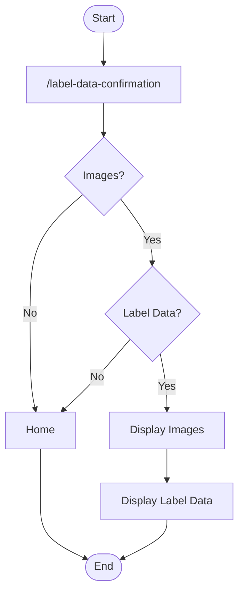
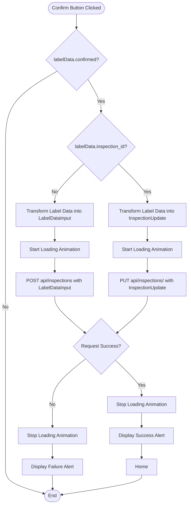
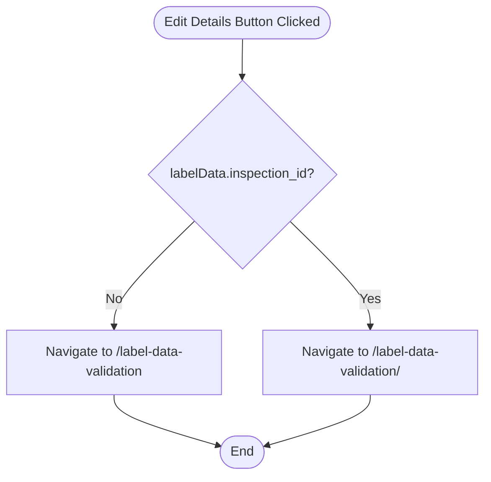

# Flowcharts

## Launch /label-data-confirmation

```mermaid
flowchart TD
    Start([Start]) --> LabelDataConfirmation["/label-data-confirmation"]
    LabelDataConfirmation --> ImagesCheck{"Images?"}
    ImagesCheck -->|No| HomePage[Home]
    ImagesCheck -->|Yes| LabelDataCheck{"Label Data?"}
    LabelDataCheck -->|No| HomePage
    LabelDataCheck -->|Yes| DisplayImages["Display Images"] --> DisplayLabelData["Display Label Data"] --> End([End])
    HomePage --> End
```

## Click on Confirm button

```mermaid
flowchart TD
    Start([Confirm Button Clicked]) --> CheckLabelDataConfirmed{"labelData.confirmed?"}
    CheckLabelDataConfirmed -->|No| End([End])
    CheckLabelDataConfirmed -->|Yes| CheckInspectionID{"labelData.inspection_id?"}
    CheckInspectionID -->|No| TransformToLabelDataInput["Transform Label Data into LabelDataInput"] --> StartLoadingAnimationNoID["Start Loading Animation"] --> PostRequest["POST api/inspections with LabelDataInput"] --> RequestSuccess
    CheckInspectionID -->|Yes| TransformLabelData["Transform Label Data into InspectionUpdate"] --> StartLoadingAnimationWithID["Start Loading Animation"] --> PutRequest["PUT api/inspections/<inspection_id> with InspectionUpdate"] --> RequestSuccess
    RequestSuccess{"Request Success?"}
    RequestSuccess -->|No| StopLoadingFailure["Stop Loading Animation"] --> DisplayFailureAlert["Display Failure Alert"] --> End
    RequestSuccess -->|Yes| StopLoadingSuccess["Stop Loading Animation"] --> DisplaySuccessAlert["Display Success Alert"] --> HomePage[Home] --> End
```

## Click on Edit button

```mermaid
flowchart TD
    Start([Edit Details Button Clicked]) --> CheckInspectionID{"labelData.inspection_id?"}
    CheckInspectionID -->|No| NavigateToBase["Navigate to /label-data-validation"] --> End([End])
    CheckInspectionID -->|Yes| NavigateToInspection["Navigate to /label-data-validation/<inspection_id>"] --> End
```
