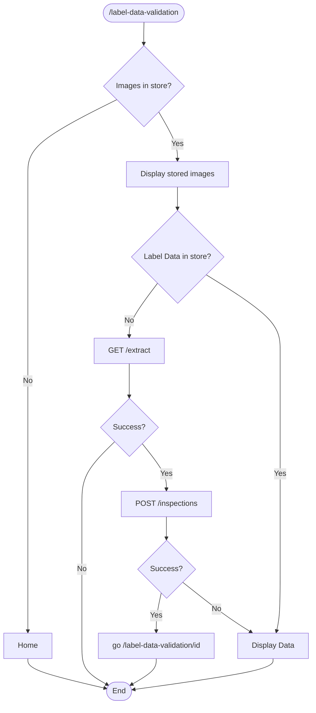
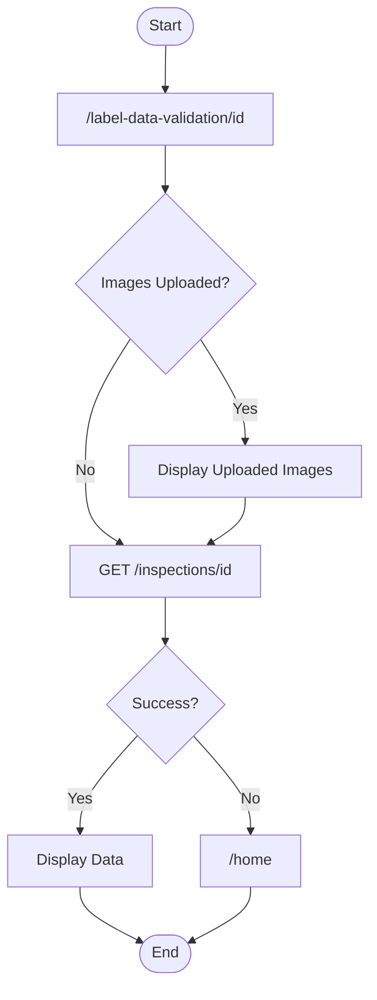

# Flowchart for launching

## /label-data-validation

```mermaid
flowchart TD
    LabelDataValidation(["/label-data-validation"]) --> ImagesInStore{Images in store?}
    ImagesInStore -->|No| HomePage[Home] --> End([End])
    ImagesInStore -->|Yes| DisplayStoredImages["Display stored images"] --> LabelDataInStore{Label Data in store?}
    LabelDataInStore -->|No| GetExtract[GET /extract]
    LabelDataInStore -->|Yes| DisplayData[Display Data]
    GetExtract --> Success{Success?}
    Success -->|No| End
    Success -->|Yes| PostInspections[POST /inspections]
    PostInspections --> SaveSuccess{Success?}
    SaveSuccess -->|Yes| LabelDataWithID["go /label-data-validation/id"] --> End
    SaveSuccess -->|No| DisplayData --> End
```

## /label-data-validation/id

```mermaid
flowchart TD
    Start([Start]) --> LabelDataValidationID["/label-data-validation/id"]
    LabelDataValidationID --> ImagesUploaded{Images Uploaded?}
    ImagesUploaded -->|No| GetInspections[GET /inspections/id]
    ImagesUploaded -->|Yes| DisplayUploadedImages["Display Uploaded Images"]
    DisplayUploadedImages --> GetInspections
    GetInspections --> FetchSuccess{Success?}
    FetchSuccess -->|No| HomePage["/home"]
    FetchSuccess -->|Yes| DisplayData["Display Data"]
    DisplayData --> End([End])
    HomePage --> End
```
