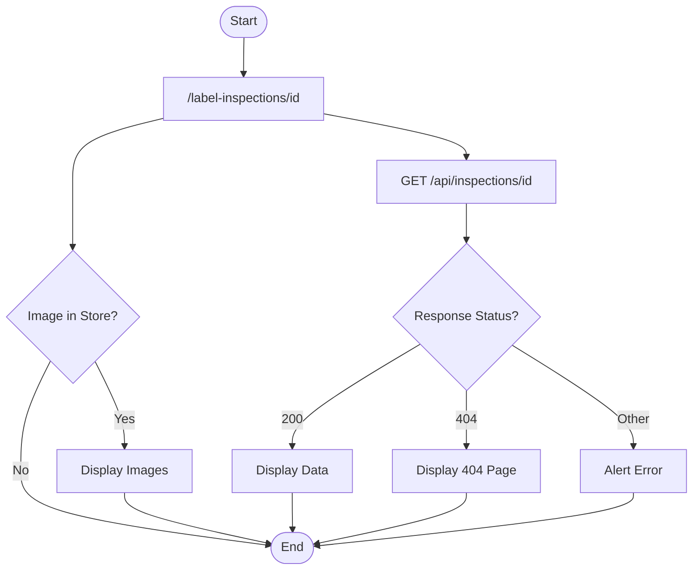

# Flowchart for launching

## /label-inspections/id

```mermaid
flowchart TD
    Start([Start]) --> LabelInspectionsID["/label-inspections/id"]

    LabelInspectionsID --> ImageInStore{Image in Store?}
    LabelInspectionsID --> GetInspections["GET /api/inspections/id"]

    ImageInStore -->|Yes| DisplayImages["Display Images"]
    ImageInStore -->|No| End([End])

    DisplayImages --> End

    GetInspections --> ResponseStatus{Response Status?}

    ResponseStatus -->|200| DisplayData["Display Data"]
    ResponseStatus -->|404| NotFoundPage["Display 404 Page"]
    ResponseStatus -->|Other| AlertError["Alert Error"]

    DisplayData --> End
    NotFoundPage --> End
    AlertError --> End
```
